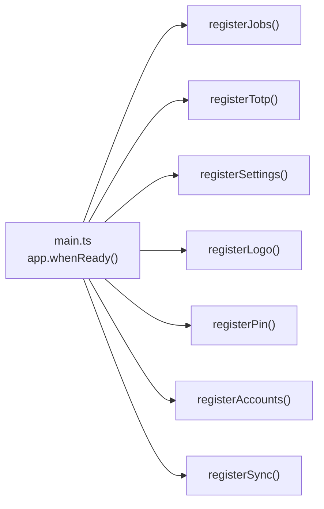
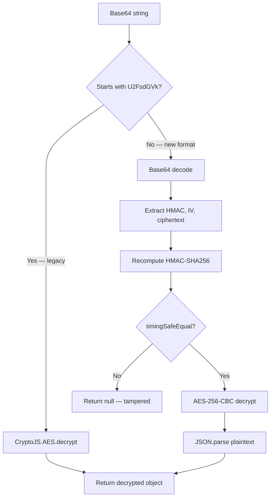
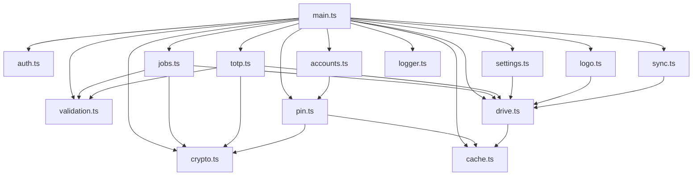
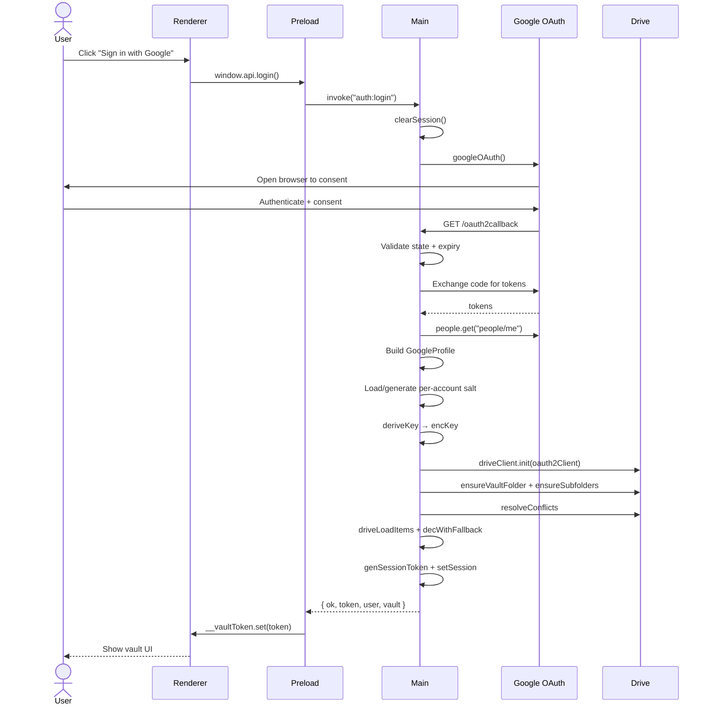
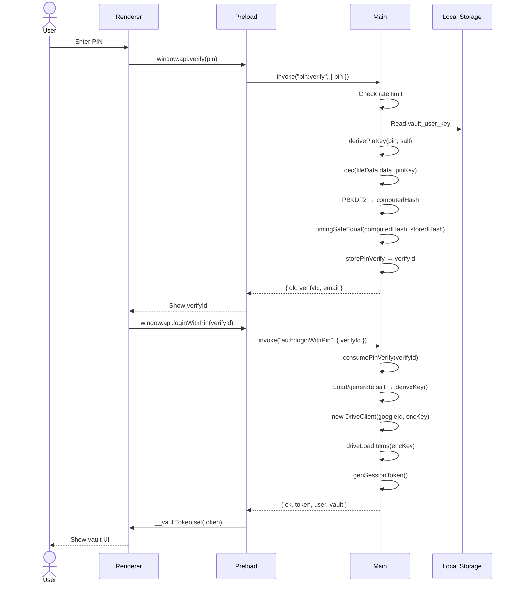
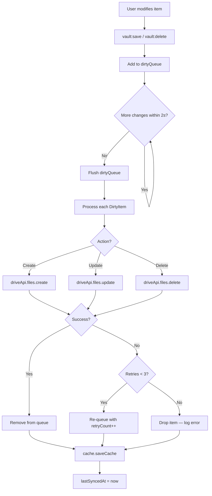
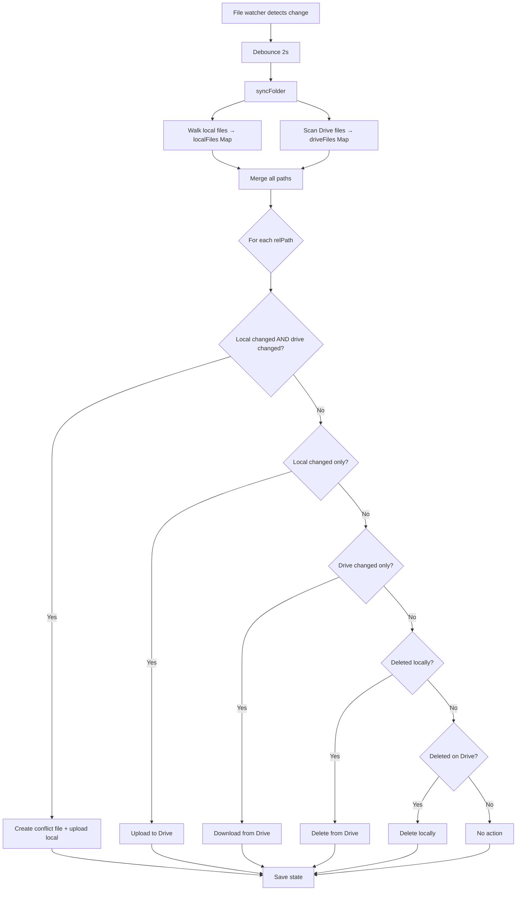

<div align="center">

# 🔐 Vault

**Encrypted password & notes vault — AES-256 client-side encryption, Google Drive sync, PIN login.**

[](https://github.com/Yassine/Vault-app/releases)
[](https://www.electronjs.org/)
[](https://www.typescriptlang.org/)
[](https://github.com/Yassine/Vault-app/releases)

_Secure storage for passwords, notes, job applications, and TOTP authenticator secrets._

[Features](#features) •
[Architecture](#architecture) •
[Security Model](#security-model) •
[Module Map](#module-map) •
[IPC Reference](#ipc-channel-reference) •
[Setup](#setup--installation) •
[Build Targets](#build-targets)

</div>

---

## Table of Contents

1. [Overview](#overview)
2. [Features](#features)
3. [Architecture](#architecture)
4. [Security Model](#security-model)
5. [Module Map](#module-map)
6. [IPC Channel Reference](#ipc-channel-reference)
7. [Data Flow Diagrams](#data-flow-diagrams)
8. [Settings Reference](#settings-reference)
9. [Logging](#logging)
10. [Setup & Installation](#setup--installation)
11. [Build Targets](#build-targets)
12. [Type Definitions](#type-definitions)

---

## Overview

Vault is an **Electron desktop application** for secure local storage of sensitive data. All data is encrypted with AES-256-CBC + HMAC-SHA256 before being stored to Google Drive, ensuring the server never sees plaintext. Authentication uses Google OAuth 2.0 with optional TOTP-based two-factor authentication. A PIN-based quick-login skips OAuth on subsequent launches.

### Key Properties

| Property           | Detail                                                                 |
| ------------------ | ---------------------------------------------------------------------- |
| **Encryption**     | AES-256-CBC + HMAC-SHA256 (encrypt-then-MAC)                           |
| **Key Derivation** | PBKDF2-SHA256, 600k iterations, per-account 32-byte salt               |
| **Legacy Support** | SHA-256 single-hash key (auto-migrated on first login)                 |
| **Storage**        | Google Drive (per-item encrypted files) + local cache                  |
| **Auth**           | Google OAuth 2.0 + TOTP 2FA + PIN quick-login                          |
| **Offline**        | Full offline support via local cache; dirty queue flushes on reconnect |
| **Platform**       | Windows (NSIS/Portable), macOS (DMG), Linux (AppImage)                 |
| **Renderer**       | Vanilla TypeScript, Vite/esbuild bundling, no framework                |
| **Main Process**   | TypeScript strict mode, compiled via `tsc`                             |

---

## Features

### Data Types

| Type                 | Description                                       | Storage                     |
| -------------------- | ------------------------------------------------- | --------------------------- |
| 🔑 **Passwords**     | Site, username, password, notes                   | `vault_password_{uuid}`     |
| 📝 **Notes**         | Free-form text entries                            | `vault_note_{uuid}`         |
| 💼 **Job Tracker**   | Company, role, email, status, applied date, notes | `vault_job_{uuid}`          |
| 🔐 **Authenticator** | TOTP secrets (name, issuer, secret, icon)         | `vault_totp_{uuid}`         |
| 🗑️ **Trash**         | Soft-deleted items with restore/purge             | Same as original type       |
| 🎨 **Logos**         | Favicon cache as data URLs                        | `vault_logos` (single JSON) |

### Feature Matrix

| Feature                        | Status | Notes                                                |
| ------------------------------ | ------ | ---------------------------------------------------- |
| AES-256-CBC + HMAC-SHA256      | ✅     | Encrypt-then-MAC, random 16-byte IV per encryption   |
| PBKDF2-SHA256 key derivation   | ✅     | 600k iterations, per-account salt                    |
| Legacy CryptoJS decryption     | ✅     | Auto-detected via `U2FsdGVk` prefix                  |
| Google Drive per-item files    | ✅     | One file per item, AES-encrypted JSON                |
| Local cache with offline mode  | ✅     | Full offline reads; dirty queue for writes           |
| ETag-based conflict resolution | ✅     | On startup, diffs local cache vs Drive               |
| Debounced sync                 | ✅     | 2-second debounce after last change                  |
| Google OAuth 2.0               | ✅     | Local HTTP callback server on `127.0.0.1:42813`      |
| TOTP 2FA                       | ✅     | Via `speakeasy`, 6-digit codes, window=1             |
| PIN quick-login                | ✅     | 4-12 chars, numbers-only or alphanumeric             |
| 2FA rate limiting              | ✅     | 5 attempts / 15-min window, 15-min lockout           |
| PIN rate limiting              | ✅     | Same limits, persisted to disk                       |
| System tray                    | ✅     | Lock, logout, quit from tray menu                    |
| Window controls                | ✅     | Minimize, maximize, close-to-tray                    |
| Sound feedback                 | ✅     | Web Audio API, configurable tones                    |
| Password generator             | ✅     | CSPRNG, Fisher-Yates, guaranteed class coverage      |
| 13 accent colors               | ✅     | Applied via CSS custom properties                    |
| Sync engine                    | ✅     | Two-way folder sync with conflict detection          |
| File watcher                   | ✅     | `fs.watch` with 2-second debounce                    |
| Drag-and-drop sync             | ✅     | Drop files/folders into sync panel                   |
| CSP hardening                  | ✅     | `script-src 'self'`, `frame-src 'none'`              |
| XSS prevention                 | ✅     | `createElement` / `textContent` only, no `innerHTML` |
| Navigation blocking            | ✅     | `will-navigate` blocks non-file: URLs                |
| Clipboard auto-clear           | ✅     | 30-second timeout                                    |
| Session token rotation         | ✅     | Regenerated on every auth event                      |
| Log rotation                   | ✅     | 5 MB max per file, 7-day bak cleanup                 |

---

## Architecture

### Process Model

```mermaid
graph TB
    subgraph Renderer["Renderer Process"]
        R["app.ts\n(index.html + app.css)"]
    end

    subgraph Preload["Preload Bridge"]
        P["preload.ts\n(contextBridge)"]
    end

    subgraph Main ["Main Process"]
        M ["main.ts (~1550 lines)"]
        MOD ["modules/"]
        CRYPTO ["Crypto AES-256-CBC+HMAC"]
        AUTH ["Session + 2FA"]
        OAUTH ["OAuth Server 127.0.0.1:42813"]
        LOGGER ["Logger Per-level files"]
    end

    subgraph Drive ["Google Drive"]
        VF ["Vault/"]
        PW ["passwords/"]
        NOTES ["notes/"]
        JOBS ["jobs/"]
        TOTP ["totp/"]
        SETTINGS ["settings/"]
        SYNC ["sync/"]
    end

    subgraph Cache ["Local Cache"]
        CF ["vault_cache.json"]
    end

    subgraph Local ["Local Files"]
        PIN ["vault_user_key (PIN)"]
        ACC ["vault_accounts (Saved)"]
        UIS ["vault_settings (UI)"]
        LOGS ["Logs/"]
    end

    R -->|"window.api.*()"| P
    P -->|"IPC"| M
    M -->|enc/dec| CRYPTO
    M -->|requireAuth| AUTH
    M -->|googleOAuth| OAUTH
    OAUTH -->|googleapis| Drive
    M -->|load/save| Cache
    M -->|info/error/authLog| LOGGER
    M -->|fs| Local
    M -->|registerJobs/Totp| MOD
    MOD -->|DriveClient| Drive
    MOD -->|cache| Cache
    MOD -->|enc/dec| CRYPTO
```

### Module Registration Pattern

All domain modules export a `register()` function called inside `app.whenReady()`. Each receives a standard set of dependencies:



### File Structure

| File                        | Role                                                  | Lines (approx) |
| --------------------------- | ----------------------------------------------------- | -------------- |
| `src/main.ts`               | Entry point, window creation, OAuth, IPC registration | ~1550          |
| `src/modules/auth.ts`       | Session token gen/validation, rate limiting           | ~128           |
| `src/modules/crypto.ts`     | Key derivation, AES-256-CBC + HMAC, legacy fallback   | ~191           |
| `src/modules/validation.ts` | Input sanitization, type/email/TOTP validators        | ~60            |
| `src/modules/drive.ts`      | Google Drive CRUD, dirty queue, sync engine           | ~855           |
| `src/modules/cache.ts`      | Local file-based cache, dirty tracking                | ~115           |
| `src/modules/pin.ts`        | PIN setup/verify/change/disable, rate limiting        | ~528           |
| `src/modules/accounts.ts`   | Saved accounts for quick PIN login                    | ~250           |
| `src/modules/jobs.ts`       | Job tracker CRUD with validation                      | ~334           |
| `src/modules/totp.ts`       | TOTP secret management                                | ~162           |
| `src/modules/settings.ts`   | Settings load/save with validation                    | ~237           |
| `src/modules/logo.ts`       | Favicon fetching + caching                            | ~186           |
| `src/modules/sync.ts`       | Two-way folder sync with file watcher                 | ~1249          |
| `src/types/index.ts`        | Shared TypeScript interfaces                          | ~216           |
| `src/logger.ts`             | Structured logging to per-level files                 | ~271           |
| `preload.ts`                | Context bridge, session token closure                 | ~304           |
| `index.html`                | All renderer UI (single file)                         | —              |
| `app.ts`                    | Renderer JS — events, DOM, state, sounds              | —              |
| `app.css`                   | Single stylesheet, oklch(), glassmorphism             | —              |

---

## Security Model

### Encryption

#### Algorithm: AES-256-CBC + HMAC-SHA256 (Encrypt-then-MAC)

```mermaid
flowchart TD
    A[Plaintext object] -->|JSON.stringify| B[Plaintext string]
    B --> C[Generate random 16-byte IV]
    C --> D[encKey = SHA-256(hexKey)]
    C --> E[macKey = SHA-256(hexKey + "mac")]
    D --> F[AES-256-CBC encrypt]
    E --> G[HMAC-SHA256 over IV + ciphertext]
    F --> H[Pack: HMAC || IV || ciphertext]
    G --> H
    H -->|Base64 encode| I[Base64 string]
```

#### Decryption Flow



#### Key Derivation

| Path                 | Algorithm                     | Iterations | Output             |
| -------------------- | ----------------------------- | ---------- | ------------------ |
| **New (with salt)**  | PBKDF2-SHA256(googleId, salt) | 600,000    | 32-byte hex string |
| **Legacy (no salt)** | SHA-256("vault:" + googleId)  | 1          | 32 hex chars       |

The per-account salt is generated on first login, stored inside the encrypted settings payload, and persisted in the local cache. Legacy accounts are transparently migrated on first PIN/OAuth login.

#### Key Splitting

```
hexKey (64 chars = 32 bytes)
  ├── encKey = SHA-256(hexKey)       → AES-256 encryption key
  └── macKey  = SHA-256(hexKey+"mac") → HMAC-SHA256 key
```

### Session Management

| Property         | Value                                                       |
| ---------------- | ----------------------------------------------------------- |
| Token generation | `crypto.randomBytes(32).toString("hex")` (64 hex chars)     |
| Validation       | `crypto.timingSafeEqual()` with safe fallback buffers       |
| Max age          | 12 hours                                                    |
| Rotation         | Regenerated on every auth event (login, 2FA verify, reauth) |
| Clearing         | Cleared on logout/lock, cleared from preload closure        |
| Storage          | Preload closure only — never in renderer DOM                |

### PIN Authentication

| Property       | Value                                                                      |
| -------------- | -------------------------------------------------------------------------- |
| Length         | 4-12 characters                                                            |
| Character set  | Numbers-only (default) or alphanumeric (`pin_allow_alpha`)                 |
| Key derivation | `derivePinKey(pin, salt)` — PBKDF2-SHA256, 600k iterations                 |
| PIN hash       | Separate PBKDF2-SHA256 (600k iterations) inside encrypted payload          |
| Storage        | `%APPDATA%/Vault/vault_user_key` (local only, never sent to server)        |
| File format    | `JSON.stringify({ version: 1, salt: base64, data: enc(payload, pinKey) })` |
| Rate limiting  | 5 attempts / 15-min sliding window, 15-min lockout                         |
| Timing safety  | Constant-time comparison via `timingSafeEqual` + dummy buffer on failure   |

### OAuth Hardening

| Control               | Implementation                                                                               |
| --------------------- | -------------------------------------------------------------------------------------------- |
| State parameter       | 16-byte random hex, single-use, consumed immediately on callback                             |
| State expiry          | 5 minutes                                                                                    |
| Origin validation     | Logged but not blocking (browsers strip Origin on cross-origin redirects)                    |
| Callback server       | `127.0.0.1:42813`, single-use, closed after callback                                         |
| CSP on callback pages | `default-src 'none'; style-src 'nonce-...'; script-src 'nonce-...'`                          |
| Redirect URI          | Configurable via `REDIRECT_URI` env var, defaults to `http://localhost:42813/oauth2callback` |
| Scopes                | `openid`, `email`, `profile`, `drive.file`                                                   |

### 2FA Rate Limiting

| Parameter        | Value                                  |
| ---------------- | -------------------------------------- |
| Max attempts     | 5 per 15-minute sliding window         |
| Lockout duration | 15 minutes                             |
| Token format     | 6-digit numeric (`/^\d{6}$/`)          |
| Verification     | `speakeasy.totp.verify({ window: 1 })` |

### Renderer Security

| Control           | Implementation                                                                         |
| ----------------- | -------------------------------------------------------------------------------------- |
| CSP               | `script-src 'self'`, `frame-src 'none'`, `worker-src 'none'`                           |
| XSS               | All user data via `createElement` / `textContent` — no `innerHTML` for dynamic content |
| Navigation        | `will-navigate` blocks non-file: URLs                                                  |
| New windows       | `setWindowOpenHandler` denies all; external URLs open in system browser                |
| Context isolation | `contextIsolation: true`, `nodeIntegration: false`                                     |
| Preload           | Session token in closure, inaccessible to renderer DOM                                 |

### Clipboard Security

Sensitive data copied to clipboard is auto-cleared after **30 seconds**.

---

## Module Map

### Module Responsibilities

| Module       | File                        | Responsibility                                                                                                                           |
| ------------ | --------------------------- | ---------------------------------------------------------------------------------------------------------------------------------------- |
| `auth`       | `src/modules/auth.ts`       | Session token generation/validation, `requireAuth()` / `requireAuthNoArgs()` IPC guards, 2FA rate limiting                               |
| `crypto`     | `src/modules/crypto.ts`     | Key derivation (PBKDF2-SHA256 / legacy SHA-256), AES-256-CBC + HMAC-SHA256 encrypt/decrypt, CryptoJS legacy fallback, PIN key derivation |
| `validation` | `src/modules/validation.ts` | `sanitizeStr`, `validType`, `validEmail`, `validTotpSecret`, `validDomain` — all IPC boundary validators                                 |
| `drive`      | `src/modules/drive.ts`      | Google Drive CRUD, dirty queue with retry, debounced sync, ETag conflict resolution, settings/2FA/logo persistence                       |
| `cache`      | `src/modules/cache.ts`      | Local file-based cache (`vault_cache.json`), dirty tracking, forward-compat field merging                                                |
| `pin`        | `src/modules/pin.ts`        | PIN setup/verify/change/disable, in-memory verify store (30s TTL), persisted rate limiting                                               |
| `accounts`   | `src/modules/accounts.ts`   | Saved accounts list (max 10, sorted by lastUsed), upsert/touch/remove operations                                                         |
| `jobs`       | `src/modules/jobs.ts`       | Job tracker CRUD with field validation (email, date format, status enum)                                                                 |
| `totp`       | `src/modules/totp.ts`       | TOTP secret management with base32 validation                                                                                            |
| `settings`   | `src/modules/settings.ts`   | Settings load/save with full validation (accent, tones, durations, generator options)                                                    |
| `logo`       | `src/modules/logo.ts`       | Favicon fetching from Google's favicon API, MIME detection, data-URL caching, private IP blocking                                        |
| `sync`       | `src/modules/sync.ts`       | Two-way folder sync engine with `fs.watch`, conflict detection, path validation, ignore patterns                                         |

### Module Dependency Graph



---

## IPC Channel Reference

All handlers use `ipcMain.handle`. Every handler returns `{ ok: boolean, ... }`. Errors are caught and returned as `{ ok: false, error: string }` — raw errors are never leaked to the renderer.

### Auth Namespace

| Channel             | Auth | Description                                                                    |
| ------------------- | ---- | ------------------------------------------------------------------------------ |
| `auth:login`        | No   | Initiates Google OAuth flow; returns user profile + vault data + session token |
| `auth:verify2fa`    | Yes  | Verifies 6-digit TOTP code; returns new token + vault data                     |
| `auth:reauth`       | No   | Re-authenticates via OAuth (token refresh / different browser session)         |
| `auth:loginWithPin` | No   | Completes PIN login using `verifyId` from `pin:verify`                         |
| `auth:logout`       | Yes  | Flushes Drive sync, clears session, closes Drive client                        |
| `auth:lock`         | Yes  | Clears session from memory (shows PIN or login screen)                         |

### Vault Namespace

| Channel         | Auth | Description                                          |
| --------------- | ---- | ---------------------------------------------------- |
| `vault:save`    | Yes  | Creates or updates a password/note; sanitizes fields |
| `vault:delete`  | Yes  | Soft-deletes an item (moves to trash)                |
| `vault:sync`    | Yes  | Forces Drive sync, returns fresh vault data          |
| `vault:reorder` | Yes  | Updates sort order for a list of items               |

### Trash Namespace

| Channel         | Auth | Description                  |
| --------------- | ---- | ---------------------------- |
| `trash:load`    | Yes  | Loads all soft-deleted items |
| `trash:restore` | Yes  | Restores a soft-deleted item |
| `trash:purge`   | Yes  | Permanently deletes an item  |

### Jobs Namespace

| Channel              | Auth | Description                                             |
| -------------------- | ---- | ------------------------------------------------------- |
| `jobs:load`          | Yes  | Loads all job entries                                   |
| `jobs:save`          | Yes  | Creates or updates a job; validates email, date, status |
| `jobs:delete`        | Yes  | Soft-deletes a job                                      |
| `jobs:reorder`       | Yes  | Updates job sort order                                  |
| `jobs:trash:load`    | Yes  | Loads soft-deleted jobs                                 |
| `jobs:trash:restore` | Yes  | Restores a soft-deleted job                             |
| `jobs:trash:purge`   | Yes  | Permanently deletes a job                               |

### TOTP Namespace

| Channel       | Auth | Description                                        |
| ------------- | ---- | -------------------------------------------------- |
| `totp:load`   | Yes  | Loads all TOTP secrets                             |
| `totp:save`   | Yes  | Creates or updates a TOTP secret; validates base32 |
| `totp:delete` | Yes  | Permanently deletes a TOTP secret                  |

### 2FA Namespace

| Channel       | Auth | Description                                             |
| ------------- | ---- | ------------------------------------------------------- |
| `2fa:status`  | Yes  | Returns `{ enabled: boolean }`                          |
| `2fa:setup`   | Yes  | Generates new TOTP secret; returns base32 + otpauth URL |
| `2fa:enable`  | Yes  | Verifies code + enables 2FA                             |
| `2fa:disable` | Yes  | Verifies code + disables 2FA                            |

### Settings Namespace

| Channel         | Auth | Description                                         |
| --------------- | ---- | --------------------------------------------------- |
| `settings:load` | Yes  | Returns validated settings (defaults on first load) |
| `settings:save` | Yes  | Validates + persists settings to Drive              |

### Logo Namespace

| Channel      | Auth | Description                                      |
| ------------ | ---- | ------------------------------------------------ |
| `logo:fetch` | Yes  | Fetches favicon, caches as data URL, returns URL |

### PIN Namespace

| Channel       | Auth | Description                                                  |
| ------------- | ---- | ------------------------------------------------------------ |
| `pin:status`  | No   | Returns `{ ok, enabled }` — used for startup screen decision |
| `pin:setup`   | Yes  | Validates PIN, creates encrypted user key file               |
| `pin:verify`  | No   | Rate-limited; returns `verifyId` + `email` on success        |
| `pin:change`  | Yes  | Verifies old PIN, writes new file with new salt              |
| `pin:disable` | Yes  | Deletes user key file                                        |

### Accounts Namespace

| Channel               | Auth | Description                                       |
| --------------------- | ---- | ------------------------------------------------- |
| `accounts:list`       | No   | Returns saved accounts (filtered by PIN googleId) |
| `accounts:save`       | Yes  | Upserts current session's account                 |
| `accounts:remove`     | Yes  | Removes current session's account                 |
| `accounts:removeById` | No   | Removes account by googleId (from PIN screen)     |
| `accounts:touch`      | No   | Updates `lastUsed` timestamp                      |

### Sync Namespace

| Channel               | Auth | Description                                        |
| --------------------- | ---- | -------------------------------------------------- |
| `sync:folders:list`   | Yes  | Lists all sync folders                             |
| `sync:folders:add`    | Yes  | Validates path, adds sync folder, starts watcher   |
| `sync:folders:remove` | Yes  | Removes folder, stops watcher                      |
| `sync:folders:toggle` | Yes  | Enables/disables a folder                          |
| `sync:status`         | Yes  | Returns full sync config                           |
| `sync:now`            | Yes  | Triggers manual sync across all enabled folders    |
| `sync:browse-folder`  | Yes  | Opens OS folder picker dialog                      |
| `sync:file-states`    | Yes  | Returns per-file sync state for all folders        |
| `sync:handle-drop`    | Yes  | Processes OS drag-and-drop paths into sync folders |

### Window Namespace

| Channel        | Auth | Description                     |
| -------------- | ---- | ------------------------------- |
| `win:minimize` | Yes  | Minimizes the main window       |
| `win:maximize` | Yes  | Toggles maximize state          |
| `win:close`    | Yes  | Minimizes to tray (macOS: hide) |

### Internal (preload → main only)

| Channel         | Direction       | Description                                         |
| --------------- | --------------- | --------------------------------------------------- |
| `preload:log`   | Renderer → Main | Bridge call logging (action, channel, ok, detail)   |
| `preload:token` | Renderer → Main | Token state change notification ("set" / "cleared") |

---

## Data Flow Diagrams

### Login Flow



### PIN Login Flow



### Encrypt/Decrypt Flow

```mermaid
flowchart LR
    subgraph Encrypt ["Encrypt"]
        E1 ["Plaintext object"] -->|"JSON.stringify"| E2 ["Plaintext string"]
        E2 --> E3 ["Random 16-byte IV"]
        E3 --> E4 ["encKey = SHA-256(hexKey)"]
        E3 --> E5 ["macKey = SHA-256(hexKey + 'mac')"]
        E4 --> E6 ["AES-256-CBC encrypt"]
        E5 --> E7 ["HMAC-SHA256 over IV + ciphertext"]
        E6 --> E8 ["Pack: HMAC || IV || ct"]
        E7 --> E8
        E8 -->|"Base64"| E9 ["Base64 string"]
    end

    subgraph Decrypt ["Decrypt"]
        D1 ["Base64 string"] --> D2 {"U2FsdGVk prefix?"}
        D2 -->|"Yes — legacy"| D3 ["CryptoJS.AES.decrypt"]
        D2 -->|"No — new format"| D4 ["Base64 decode"]
        D4 --> D5 ["Split HMAC, IV, CT"]
        D5 --> D6 ["Recompute HMAC-SHA256"]
        D6 --> D7 {"timingSafeEqual?"}
        D7 -->|"Yes"| D8 ["AES-256-CBC decrypt"]
        D7 -->|"No"| D9 ["Return null — tampered"]
        D8 --> D10 ["JSON.parse plaintext"]
        D3 --> D11 ["Return decrypted object"]
        D10 --> D11
    end
```

### Drive Sync Flow



### Sync Engine Two-Way Flow



---

## Settings Reference

All settings are validated server-side before persistence. Invalid values fall back to defaults.

| Setting             | Type    | Default    | Validation                                                       |
| ------------------- | ------- | ---------- | ---------------------------------------------------------------- |
| `lock_timeout`      | number  | `5`        | 0-120 (minutes)                                                  |
| `lock_action`       | string  | `"lock"`   | `"lock"` or `"exit"`                                             |
| `lock_countdown`    | boolean | `true`     | —                                                                |
| `lock_on_minimize`  | boolean | `false`    | —                                                                |
| `pin_login_enabled` | boolean | `false`    | —                                                                |
| `pin_allow_alpha`   | boolean | `false`    | —                                                                |
| `compact`           | boolean | `false`    | —                                                                |
| `animations`        | boolean | `true`     | —                                                                |
| `accent`            | string  | `"violet"` | One of 13 accent colors                                          |
| `gen_length`        | number  | `20`       | 8-128                                                            |
| `gen_symbols`       | boolean | `true`     | —                                                                |
| `gen_numbers`       | boolean | `true`     | —                                                                |
| `gen_ambiguous`     | boolean | `false`    | —                                                                |
| `gen_copy`          | boolean | `true`     | —                                                                |
| `sounds`            | boolean | `true`     | —                                                                |
| `sound_login`       | boolean | `true`     | —                                                                |
| `sound_exit`        | boolean | `true`     | —                                                                |
| `sound_hover`       | boolean | `false`    | —                                                                |
| `sound_login_tone`  | string  | `"chime"`  | `chime`, `ding`, `soft`, `bright`                                |
| `sound_exit_tone`   | string  | `"chime"`  | `chime`, `ding`, `soft`, `bright`                                |
| `sound_hover_tone`  | string  | `"click"`  | `chime`, `ding`, `soft`, `bright`, `click`, `tap`, `pop`, `none` |
| `toast_duration`    | number  | `2400`     | `1500`, `2400`, `3500`, `5000` (ms)                              |

### Accent Colors

`violet`, `blue`, `teal`, `green`, `orange`, `rose`, `red`, `pink`, `yellow`, `amber`, `cyan`, `indigo`, `lime`

---

## Logging

Vault uses structured logging to per-level files in the `Logs/` directory.

### Log Files

| File               | Level   | Purpose                                    |
| ------------------ | ------- | ------------------------------------------ |
| `Logs/debug.log`   | DEBUG   | Verbose diagnostic output                  |
| `Logs/info.log`    | INFO    | General operational events                 |
| `Logs/success.log` | SUCCESS | Successful operations                      |
| `Logs/warn.log`    | WARN    | Warnings and recoverable issues            |
| `Logs/error.log`   | ERROR   | Errors with stack traces                   |
| `Logs/auth.log`    | AUTH    | Authentication events (login, logout, 2FA) |
| `Logs/ipc.log`     | IPC     | IPC bridge calls and preload events        |
| `Logs/db.log`      | DB      | Database/cache operations                  |
| `Logs/all.log`     | ALL     | Combined output of all levels              |

### Log Format

```
[2026-06-25T10:30:00.000Z] [auth:login] OAuth success | data: {"email":"user@example.com"}
```

### Rotation

| Parameter        | Value              |
| ---------------- | ------------------ |
| Max file size    | 5 MB               |
| Backup extension | `.{timestamp}.bak` |
| Backup cleanup   | 7 days             |

### Log Output Locations

| Platform | Path                                        |
| -------- | ------------------------------------------- |
| Windows  | `%APPDATA%/Vault/Logs/`                     |
| macOS    | `~/Library/Application Support/Vault/Logs/` |
| Linux    | `~/.config/Vault/Logs/`                     |
| Portable | `{executable-dir}/vault-errors.log`         |

---

## Setup & Installation

### Prerequisites

| Requirement          | Version | Purpose                               |
| -------------------- | ------- | ------------------------------------- |
| Node.js              | ≥ 18    | Runtime                               |
| npm                  | ≥ 9     | Package manager                       |
| Google Cloud Project | —       | OAuth credentials + Drive API enabled |

### Environment Variables

Create a `.env` file in the project root:

```env
GOOGLE_CLIENT_ID=your-client-id.apps.googleusercontent.com
GOOGLE_CLIENT_SECRET=your-client-secret
REDIRECT_URI=http://localhost:42813/oauth2callback  # optional, defaults to this value
```

> **⚠️ Required:** `GOOGLE_CLIENT_ID` and `GOOGLE_CLIENT_SECRET` must be set. The app exits with an error dialog if either is missing.

### Google Cloud Setup

1. Go to [Google Cloud Console](https://console.cloud.google.com/)
2. Create a new project or select existing
3. Enable **Google Drive API** (APIs & Services → Library → search "Google Drive API")
4. Create **OAuth 2.0 Credentials** (APIs & Services → Credentials → Create OAuth Client ID)
5. Application type: **Web application**
6. Add Authorized redirect URI: `http://localhost:42813/oauth2callback`
7. Copy Client ID and Client Secret to `.env`

### Install & Run

```bash
# Install dependencies
npm install

# Type-check (no emit)
npm run typecheck

# Development mode (Vite dev server + tsx main + DevTools detached)
npm run dev

# Production build (Vite build + tsc compile)
npm run build:all

# Run production build
npm start
```

### Development Notes

- `npm run dev` starts Vite dev server on `localhost:5173`, `tsc --watch` for main process, and opens Electron with DevTools detached.
- Renderer changes hot-reload via Vite. Main process changes require Electron restart (or use `tsc --watch` + relaunch).
- No test suite, linter, or formatter is currently configured.

---

## Build Targets

### Windows

```bash
npm run build:win
```

| Target         | Output                           |
| -------------- | -------------------------------- |
| NSIS installer | `dist/Vault Setup {version}.exe` |
| Portable       | `dist/Vault-{version}.exe`       |

### macOS

```bash
npm run build:mac
```

| Target | Output                     |
| ------ | -------------------------- |
| DMG    | `dist/Vault-{version}.dmg` |

### Linux

```bash
npm run build:linux
```

| Target   | Output                          |
| -------- | ------------------------------- |
| AppImage | `dist/Vault-{version}.AppImage` |

### Build Configuration

| Property       | Value                                                        |
| -------------- | ------------------------------------------------------------ |
| App ID         | `com.vault.app`                                              |
| Product Name   | `Vault`                                                      |
| Icon           | `assets/icon` (`.png` / `.ico`)                              |
| Files included | `dist/**/*`                                                  |
| Excluded       | `dist/win-unpacked{,/**/*}`, `dist/win-unpacked.tmp{,/**/*}` |

---

## Type Definitions

Core shared types from `src/types/index.ts`:

### Session

```typescript
interface Session {
  googleId: string;
  email: string;
  name: string;
  avatar: string | null;
  userId: string;
  encKey: string;
  pending2fa: boolean;
}
```

### VaultItem

```typescript
interface VaultItem {
  _localId?: string;
  _sort?: number;
  id?: string;
  site?: string;
  username?: string;
  password?: string;
  notes?: string;
  type?: string;
  title?: string;
  body?: string;
  [key: string]: unknown;
}
```

### Job

```typescript
interface Job {
  id?: string;
  company: string;
  role: string;
  email: string;
  applied_at: string;
  status: "wait" | "accepted" | "rejected";
  notes: string;
  sort_order?: number;
  deleted_at?: string;
  created_at?: string;
  updated_at?: string;
}
```

### TotpItem

```typescript
interface TotpItem {
  id?: string;
  name: string;
  issuer: string;
  secret: string;
  icon: string;
  sort_order?: number;
}
```

### Settings

```typescript
interface Settings {
  lock_timeout: number; // 0-120 minutes
  lock_action: "lock" | "exit";
  lock_countdown: boolean;
  lock_on_minimize: boolean;
  pin_login_enabled: boolean;
  pin_allow_alpha: boolean;
  compact: boolean;
  animations: boolean;
  accent: AppAccent; // 13 colors
  gen_length: number; // 8-128
  gen_symbols: boolean;
  gen_numbers: boolean;
  gen_ambiguous: boolean;
  gen_copy: boolean;
  sounds: boolean;
  sound_login: boolean;
  sound_exit: boolean;
  sound_hover: boolean;
  sound_login_tone: AppSoundTone;
  sound_exit_tone: AppSoundTone;
  sound_hover_tone: AppHoverTone;
  toast_duration: number; // 1500 | 2400 | 3500 | 5000
}
```

### Cache Data

```typescript
interface CacheData {
  version: number;
  googleId: string;
  passwords: CacheItem[];
  notes: CacheItem[];
  jobs: CacheItem[];
  totp: CacheItem[];
  settings: Record<string, unknown> | null;
  twofa: { secret: string; enabled: boolean } | null;
  logos: CacheLogo[];
  dirtyQueue: DirtyItem[];
  etags: Record<string, string>;
  lastSyncedAt: number;
}
```

### Sync Types

```typescript
type SyncFolderStatus = "idle" | "syncing" | "error" | "conflict";
type SyncConflictType = "none" | "local_newer" | "drive_newer" | "both";

interface SyncFolder {
  id: string;
  localPath: string;
  driveFolderName: string;
  includePaths?: string[];
  enabled: boolean;
  lastSyncAt: number | null;
  status: SyncFolderStatus;
  errorMessage?: string;
}

interface SyncFileState {
  relativePath: string;
  localHash: string | null;
  localMtime: number | null;
  driveFileId: string | null;
  driveModifiedTime: string | null;
  driveHash: string | null;
  conflict: SyncConflictType;
}
```

---

<div align="center">

**Vault** — Encrypted password & notes vault built with Electron + TypeScript.

_Built with AES-256-CBC + HMAC-SHA256, Google Drive sync, and zero frameworks._

</div>
