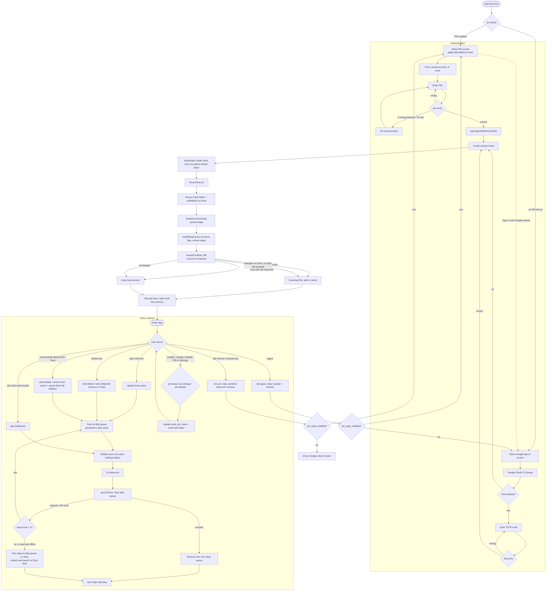

<div align="center">

# 🔐 Vault

**Encrypted password & notes vault — AES-256 client-side encryption, Google Drive sync, PIN login.**

[](https://github.com/yassine808/drive-vault-app/releases)
[](https://www.electronjs.org/)
[](https://www.typescriptlang.org/)
[](https://github.com/yassine808/drive-vault-app/releases)

_Secure storage for passwords, notes, job applications, and TOTP authenticator secrets._

</div>

---

## Overview

Vault is an **Electron desktop app** for secure local storage of sensitive data. Everything is encrypted client-side (AES-256-CBC + HMAC-SHA256) before it ever touches Google Drive, so the server only ever sees ciphertext. Sign in with Google OAuth 2.0 (with optional TOTP 2FA), or skip straight past OAuth on later launches with a local PIN.

| Property           | Detail                                                           |
| ------------------ | ----------------------------------------------------------------- |
| **Encryption**      | AES-256-CBC + HMAC-SHA256 (encrypt-then-MAC), per-item files      |
| **Key derivation**  | PBKDF2-SHA256, 600k iterations, per-account salt                  |
| **Storage**         | Google Drive (one encrypted file per item) + local offline cache  |
| **Auth**            | Google OAuth 2.0 + optional TOTP 2FA + optional PIN quick-login   |
| **Platform**        | Windows (NSIS/Portable), macOS (DMG), Linux (AppImage)            |
| **Stack**           | TypeScript throughout, no frontend framework, Vite/esbuild bundling |

For module-by-module internals, IPC channel reference, and file layout, see [`CLAUDE.md`](./CLAUDE.md). This document focuses on **how the app actually behaves end-to-end**, from cold launch to lock/logout and back.

---

## Full Lifecycle

The diagram below traces one continuous path through the app: cold start → authentication (PIN or Google) → Drive initialization & conflict resolution → the active session's CRUD/sync loop → locking or logging out and looping back to the start.



### Reading the flow

**Cold start.** The renderer never assumes it knows anything before `pin:status` answers — that single call decides both which screen to show and, now, whether the PIN input should accept letters (`allowAlpha`), since real session settings don't exist yet at this point.

**Authentication.** Both paths converge on a session token. PIN login never lets a token or Google ID pass through the renderer in cleartext — `pin:verify` hands back a short-lived `verifyId` that only `auth:loginWithPin` can redeem. Five wrong PIN attempts in 15 minutes trigger a 15-minute lockout, tracked on disk so it survives an app restart.

**Drive init & conflict resolution.** This is the step that keeps the local cache honest. A snapshot of each file's last-known `modifiedTime` is taken *before* the live index refresh overwrites it, so the app can tell "unchanged" apart from "edited elsewhere since we last synced" — the latter triggers a re-download that replaces the stale local copy, unless that item still has an unsynced local edit sitting in the dirty queue (local wins in that case).

**Active session.** Every mutation — add, edit, soft-delete (to Trash), or permanent delete — goes local-first (instant UI, offline-safe), gets queued, and is flushed to Drive on a 2-second debounce or an immediate manual "Sync now". The sidebar sync icon spins for the whole in-flight window, whether that's one save or several queued at once. Failed syncs retry up to 3 times; if the app is offline or retries are exhausted, the item simply stays in the on-disk dirty queue and is picked up again on the next launch or manual sync — nothing is silently lost. Enabling, changing, or disabling the PIN from Settings updates `vault_pin_meta` and resets the rate limiter, then returns straight back into the session.

**Locking / logging out.** Both funnel back to the same fork at the top of the diagram: if PIN login is enabled you land back on the PIN screen, otherwise back on the appropriate Google screen — closing the loop.

---

## Setup & Installation

### Prerequisites

| Requirement           | Version | Purpose                               |
| ---------------------- | ------- | -------------------------------------- |
| Node.js                | ≥ 18    | Runtime                                |
| npm                    | ≥ 9     | Package manager                        |
| Google Cloud Project   | —       | OAuth credentials + Drive API enabled  |

### Environment variables

Create a `.env` file in the project root:

```env
GOOGLE_CLIENT_ID=your-client-id.apps.googleusercontent.com
GOOGLE_CLIENT_SECRET=your-client-secret
REDIRECT_URI=http://localhost:42813/oauth2callback  # optional, defaults to this value
```

> **⚠️ Required:** `GOOGLE_CLIENT_ID` and `GOOGLE_CLIENT_SECRET` must be set. The app exits with an error dialog if either is missing.

### Google Cloud setup

1. Go to [Google Cloud Console](https://console.cloud.google.com/)
2. Create a new project or select an existing one
3. Enable **Google Drive API** (APIs & Services → Library → search "Google Drive API")
4. Create **OAuth 2.0 Credentials** (APIs & Services → Credentials → Create OAuth Client ID)
5. Application type: **Web application**
6. Add authorized redirect URI: `http://localhost:42813/oauth2callback`
7. Copy the Client ID and Client Secret into `.env`

### Install & run

```bash
# Install dependencies
npm install

# Type-check (no emit)
npm run typecheck

# Development mode (Vite dev server + tsx main + DevTools detached)
npm run dev

# Production build (Vite build + tsc compile)
npm run build:all

# Run production build
npm start
```

No test suite, linter, or formatter is currently configured.

---

## Build Targets

| Platform | Command               | Output                                                  |
| -------- | ---------------------- | -------------------------------------------------------- |
| Windows  | `npm run build:win`    | `dist/Vault Setup {version}.exe` (NSIS) + portable `.exe` |
| macOS    | `npm run build:mac`    | `dist/Vault-{version}.dmg`                                |
| Linux    | `npm run build:linux`  | `dist/Vault-{version}.AppImage`                           |

---

For architecture details, the full IPC channel reference, module map, and type definitions, see [`CLAUDE.md`](./CLAUDE.md).
