<div align="center">

# 🔐 Vault

**Encrypted password & notes vault — AES-256 client-side encryption, Google Drive sync, PIN login.**

[](https://github.com/yassine808/drive-vault-app/releases)
[](https://www.electronjs.org/)
[](https://www.typescriptlang.org/)
[](https://github.com/yassine808/drive-vault-app/releases)

_Secure storage for passwords, notes, job applications, and TOTP authenticator secrets._

</div>

---

## Overview

Vault is an **Electron desktop app** for secure local storage of sensitive data. Everything is encrypted client-side (AES-256-CBC + HMAC-SHA256) before it ever touches Google Drive, so the server only ever sees ciphertext. Sign in with Google OAuth 2.0 (with optional TOTP 2FA), or skip straight past OAuth on later launches with a local PIN.

| Property           | Detail                                                              |
| ------------------ | ------------------------------------------------------------------- |
| **Encryption**     | AES-256-CBC + HMAC-SHA256 (encrypt-then-MAC), per-item files        |
| **Key derivation** | PBKDF2-SHA256, 600k iterations, per-account salt                    |
| **Storage**        | Google Drive (one encrypted file per item) + local offline cache    |
| **Auth**           | Google OAuth 2.0 + optional TOTP 2FA + optional PIN quick-login     |
| **Platform**       | Windows (NSIS/Portable), macOS (DMG), Linux (AppImage)              |
| **Stack**          | TypeScript throughout, no frontend framework, Vite/esbuild bundling |

For module-by-module internals, IPC channel reference, and file layout, see [`CLAUDE.md`](./CLAUDE.md). This document focuses on **how the app actually behaves end-to-end**, from cold launch to lock/logout and back.

---

## Full Lifecycle

The diagram below traces the app end-to-end, matching the actual code path for each step: process boot → both login paths (with their real internal ordering — Drive is initialized _before_ the 2FA check on Google login, and PIN login rehydrates or falls back to a cache-only client) → Drive's conflict resolution → every active-session mutation and how it reaches Drive → the difference between locking, logging out, minimizing to tray, and quitting.

```mermaid
flowchart TD
    AppStart([Electron app.whenReady]) --> LoadDeps["Load CryptoJS + speakeasy"]
    LoadDeps --> RegisterIPC["Register IPC modules:<br/>jobs, totp, settings, logo, pin, accounts, sync"]
    RegisterIPC --> CreateWindow["createWindow(): frameless BrowserWindow<br/>+ system tray, loads dist/index.html"]
    CreateWindow --> RendererBoot["Renderer boots, calls pin:status"]
    RendererBoot --> CheckPin{"pin:status"}
    CheckPin -- "PIN enabled" --> PinScreen["Show PIN screen<br/>apply allowAlpha to input"]
    CheckPin -- "no PIN set up" --> LoginScreen["Show Google sign-in screen"]

    subgraph AUTH_PIN["PIN login path"]
        direction TB
        PinScreen --> PickAccount["Pick a saved account, or none"]
        PickAccount --> EnterPin["Enter PIN"]
        EnterPin --> PinVerify{"pin:verify<br/>rate-limited 5 / 15 min"}
        PinVerify -- wrong --> EnterPin
        PinVerify -- "5 wrong attempts" --> Lockout["15-minute lockout"]
        Lockout --> EnterPin
        PinVerify -- correct --> VerifyId["Returns one-time verifyId + email<br/>no PIN or token reaches the renderer"]
        VerifyId --> LoginWithPin["auth:loginWithPin(verifyId)"]
        LoginWithPin --> ConsumeVerify["consumePinVerify(verifyId) burns the one-time id"]
        ConsumeVerify --> ValidateShape["Validate googleId + email format"]
        ValidateShape --> PinSalt["Load, or generate, per-account salt"]
        PinSalt --> PinDeriveKey["deriveKey(googleId, salt) — PBKDF2-SHA256, 600k iters"]
        PinDeriveKey --> Rehydrate{"Live oauth2Client already in memory?"}
        Rehydrate -- no --> LoadTokens["loadOAuthTokens(): decrypt stored refresh token"]
        LoadTokens --> HaveTokens{"Tokens on disk?"}
        HaveTokens -- yes --> BuildClient["Rebuild oauth2Client from stored tokens"]
        HaveTokens -- no --> CacheOnlyPin["Cache-only DriveClient — offline, nothing syncs"]
        Rehydrate -- yes --> PinDriveInit
        BuildClient --> PinDriveInit["new DriveClient + driveClient.init()"]
        PinDriveInit -- "init throws" --> CacheOnlyPin
        PinDriveInit -- ok --> PersistPinSalt["Persist salt to cache settings"]
        CacheOnlyPin --> PersistPinSalt
        PinScreen -. "Sign in with Google instead" .-> LoginScreen
    end

    subgraph AUTH_GOOGLE["Google OAuth path"]
        direction TB
        LoginScreen --> ClearOldSession["auth:login: clearSession()"]
        ClearOldSession --> OAuthBusy{"OAuth already in progress?"}
        OAuthBusy -- yes --> OAuthBlocked["Reject: finish it in the browser first"]
        OAuthBusy -- no --> GoogleOAuth["googleOAuth(): spins up localhost:42813,<br/>opens system browser, exchanges code for tokens"]
        GoogleOAuth --> GoogleSalt["Load, or generate, per-account salt"]
        GoogleSalt --> GoogleDeriveKey["deriveKey(googleId, salt) — PBKDF2-SHA256, 600k iters"]
        GoogleDeriveKey --> GoogleDriveInit["new DriveClient + driveClient.init()"]
        GoogleDriveInit --> PersistTokens["persistOAuthTokens(): encrypt refresh token<br/>with Electron safeStorage"]
        PersistTokens --> TwoFACheck{"2FA enabled on this account?"}
        TwoFACheck -- yes --> PendingSession["setSession(pending2fa: true) — no session token yet"]
        PendingSession --> TwoFAScreen["Show TOTP entry screen"]
        TwoFAScreen --> TwoFAVerify{"auth:verify2fa<br/>rate-limited 5 / 15 min"}
        TwoFAVerify -- wrong --> TwoFAScreen
        TwoFAVerify -- correct --> GoogleFinish
        TwoFACheck -- no --> GoogleFinish["genSessionToken() — 12h TTL, timing-safe checked on every call"]
    end

    PersistPinSalt --> LoadVault["driveLoadItems(): decrypt every password + note"]
    GoogleFinish --> LoadVault
    LoadVault --> SetSession["setSession(...) + play login sound"]
    SetSession --> AppReady(["Enter app"])

    subgraph DRIVEINIT["driveClient.init() — run by both login paths"]
        direction TB
        DI_Start["init(authClient) called"] --> DI_Folder["ensureVaultFolder(): find/create the Vault folder on Drive"]
        DI_Folder --> DI_Sub["ensureSubfolders(): passwords/notes/jobs/totp subfolders"]
        DI_Sub --> DI_Migrate["migrateFlatFiles(): move any pre-subfolder files into place"]
        DI_Migrate --> DI_Snapshot["Snapshot previousEtags = {...cache.etags}<br/>before it gets overwritten"]
        DI_Snapshot --> DI_Build["buildFileIdCache(): list files per subfolder,<br/>refresh cache.etags to current modifiedTime"]
        DI_Build --> DI_Resolve["resolveConflicts(previousEtags)"]
        DI_Resolve -- "missing locally" --> DI_Download["downloadAndCacheItem(): add to cache"]
        DI_Resolve -- "changed on Drive, no local edit pending" --> DI_Download2["downloadAndCacheItem(): update cache item in place"]
        DI_Resolve -- "local edit still in dirty queue" --> DI_Keep["Keep local version — local edit wins"]
        DI_Resolve -- unchanged --> DI_Keep
        DI_Download --> DI_Ready(["Drive client ready"])
        DI_Download2 --> DI_Ready
        DI_Keep --> DI_Ready
    end

    GoogleDriveInit -.-> DI_Start
    PinDriveInit -.-> DI_Start

    subgraph SESSION["Active session"]
        direction TB
        AppReady --> UserAction{"User action"}

        UserAction -- "add / edit password, note, job, or TOTP entry" --> Encrypt["enc(): AES-256-CBC + HMAC-SHA256, random IV"]
        Encrypt --> SaveItem["driveClient.saveItem(): update the cache array in place,<br/>or create with a new UUID"]
        UserAction -- "delete item" --> SoftDelete["softDelete(): set deletedAt — moves item to Trash"]
        UserAction -- "restore from Trash" --> Restore["restore(): clear deletedAt"]
        UserAction -- "permanently delete from Trash" --> PermDelete["permDelete(): splice item out of the cache array"]
        UserAction -- "reorder a list" --> Reorder["updateSortOrder(): reindex every item, queue each one"]

        SaveItem --> PushDirty["pushDirty(): create/update entry —<br/>replaces any existing entry for the same id"]
        SoftDelete --> PushDirty
        Restore --> PushDirty
        Reorder --> PushDirty
        PermDelete --> PushDirtyDel["pushDirty(): delete entry"]

        PushDirty --> MarkDirty["markDirty(): (re)start the 2s debounce timer"]
        PushDirtyDel --> MarkDirty
        MarkDirty --> IconSpin["Sidebar sync icon spins — withSyncSpin"]
        IconSpin --> Debounce["2s debounce elapses with no further edits"]
        Debounce --> SyncToDrive["syncToDrive(): save cache to disk,<br/>then flush the dirty queue"]

        UserAction -- "click Sync Now button" --> ManualSync["vault:sync — syncToDrive() runs immediately,<br/>then reloads items from local cache<br/>(push-only: doesn't re-run conflict resolution)"]
        ManualSync --> IconSpin

        SyncToDrive --> ProcessItem{"For each item in the queue"}
        ProcessItem -- "create, no Drive file yet" --> DriveCreate["Drive files.create in the right subfolder"]
        ProcessItem -- "update, file exists" --> DriveUpdate["Drive files.update"]
        ProcessItem -- delete --> DriveDelete["Drive files.delete"]
        DriveCreate -- success --> ClearDirty["Remove item from dirty queue"]
        DriveUpdate -- success --> ClearDirty
        DriveDelete -- success --> ClearDirty
        DriveCreate -- "network / API error" --> Retry{"retryCount < 3?"}
        DriveUpdate -- "network / API error" --> Retry
        DriveDelete -- "network / API error" --> Retry
        Retry -- yes --> StillQueued["Stays in the dirty queue,<br/>retried next debounce, Sync Now, or launch"]
        Retry -- no --> DropItem["Drop item from queue, log the error"]
        ClearDirty --> IconStop["Icon stops spinning"]
        StillQueued --> IconStop
        DropItem --> IconStop

        UserAction -- "enable / change / disable PIN in Settings" --> PinMgmt{"pin:setup / pin:change / pin:disable"}
        PinMgmt --> UpdateMeta["Update vault_pin_meta + reset the PIN rate limiter"]
        UpdateMeta --> UserAction

        UserAction -- "manual lock (lock icon)" --> Lock["auth:lock: clearSession() only —<br/>DriveClient and any pending sync keep running"]
        UserAction -- logout --> Logout["auth:logout: driveClient.close()<br/>(flush + stop debounce timer), then clearSession()"]
        UserAction -- "idle timer expires (default 5 min, configurable)" --> AutoLockCheck{"lock_action setting"}
        AutoLockCheck -- lock --> Lock
        AutoLockCheck -- "exit app" --> QuitApp
        UserAction -- "close window (X)" --> MinimizeToTray["Hide/minimize to tray — app keeps running"]
        MinimizeToTray -.-> UserAction
        UserAction -- "Quit from tray menu, or OS shutdown" --> QuitApp["before-quit: driveClient.close() flushes any pending sync"]
    end

    Lock --> PostLockCheck{"pin_login_enabled?"}
    PostLockCheck -- yes --> PinScreen
    PostLockCheck -- no --> GoogleUnlock["Show Google unlock screen"]

    Logout --> PostLogoutCheck{"pin_login_enabled?"}
    PostLogoutCheck -- yes --> PinScreen
    PostLogoutCheck -- no --> LoginScreen

    QuitApp --> ProcessExit(["Process exits"])
```



### Reading the flow

**Boot.** The main process loads native deps, registers every IPC module (`jobs`, `totp`, `settings`, `logo`, `pin`, `accounts`, `sync`), then creates one frameless `BrowserWindow` plus a system tray icon before the renderer ever runs. Nothing in the renderer can assume a session or settings exist yet — the very first call it makes is `pin:status`, which decides both the starting screen and whether the PIN input should accept letters (`allowAlpha`).

**Google OAuth path.** Drive is initialized (folder, subfolders, migration, conflict resolution) and the refresh token is encrypted to disk **before** the 2FA check — 2FA is the last gate before a session token exists, not the first. If 2FA is enabled, a _pending_ session is set with no token yet; only a correct TOTP code (`auth:verify2fa`, rate-limited 5/15 min) produces one.

**PIN login path.** `pin:verify` never hands the renderer a password, token, or Google ID — it returns a one-time `verifyId` that `auth:loginWithPin` immediately burns via `consumePinVerify`. From there it rebuilds Drive access from a stored, encrypted OAuth refresh token if no live client exists yet; if there's no stored token, or `driveClient.init()` throws, it silently falls back to a **cache-only** client — the app still opens, but nothing syncs until a full Google sign-in restores the connection. Five wrong PIN attempts in 15 minutes trigger a 15-minute lockout, tracked on disk so it survives a restart.

**Drive init & conflict resolution.** Both login paths funnel into the exact same `driveClient.init()` sequence. The key line is the etag snapshot taken _before_ `buildFileIdCache()` refreshes the live etags — without it there'd be nothing to diff against, and edits made on another device would never come down. Items missing locally get downloaded; items that exist locally _and_ changed on Drive get re-downloaded and replace the local copy in place, unless that item still has an unsynced edit sitting in the dirty queue, in which case the local edit wins.

**Active session.** Every mutation — add, edit, soft-delete (to Trash), restore, permanent delete, or reorder — updates the local cache first (instant UI, works offline), then queues a dirty-queue entry and (re)starts a 2-second debounce. The sidebar sync icon spins for the whole in-flight window. "Sync Now" (`vault:sync`) forces an immediate flush of that queue and reloads from the local cache — it does **not** re-run conflict resolution against Drive, so it won't pull down someone else's edits the way a fresh login does. Failed Drive writes retry up to 3 times before being dropped (and logged) rather than looping forever; anything still queued when the app closes just waits for the next launch or manual sync.

**Locking vs. logging out vs. closing the window.** These three are not the same operation. **Lock** only calls `clearSession()` — the `DriveClient` instance, and any sync it has in flight, keeps running in the background. **Logout** calls `driveClient.close()` first (final flush, timer stopped, client discarded) and only then clears the session — a clean break. **Clicking the window's close button** doesn't quit at all; it minimizes to the tray so background sync can keep working. Only quitting from the tray menu or an OS shutdown hits `before-quit`, which flushes any pending sync one last time before the process exits.

---

## Setup & Installation

### Prerequisites

| Requirement          | Version | Purpose                               |
| -------------------- | ------- | ------------------------------------- |
| Node.js              | ≥ 18    | Runtime                               |
| npm                  | ≥ 9     | Package manager                       |
| Google Cloud Project | —       | OAuth credentials + Drive API enabled |

### Environment variables

Create a `.env` file in the project root:

```env
GOOGLE_CLIENT_ID=your-client-id.apps.googleusercontent.com
GOOGLE_CLIENT_SECRET=your-client-secret
REDIRECT_URI=http://localhost:42813/oauth2callback  # optional, defaults to this value
```

> **⚠️ Required:** `GOOGLE_CLIENT_ID` and `GOOGLE_CLIENT_SECRET` must be set. The app exits with an error dialog if either is missing.

### Google Cloud setup

1. Go to [Google Cloud Console](https://console.cloud.google.com/)
2. Create a new project or select an existing one
3. Enable **Google Drive API** (APIs & Services → Library → search "Google Drive API")
4. Create **OAuth 2.0 Credentials** (APIs & Services → Credentials → Create OAuth Client ID)
5. Application type: **Web application**
6. Add authorized redirect URI: `http://localhost:42813/oauth2callback`
7. Copy the Client ID and Client Secret into `.env`

### Install & run

```bash
# Install dependencies
npm install

# Type-check (no emit)
npm run typecheck

# Development mode (Vite dev server + tsx main + DevTools detached)
npm run dev

# Production build (Vite build + tsc compile)
npm run build:all

# Run production build
npm start
```

No test suite, linter, or formatter is currently configured.

---

## Build Targets

| Platform | Command               | Output                                                    |
| -------- | --------------------- | --------------------------------------------------------- |
| Windows  | `npm run build:win`   | `dist/Vault Setup {version}.exe` (NSIS) + portable `.exe` |
| macOS    | `npm run build:mac`   | `dist/Vault-{version}.dmg`                                |
| Linux    | `npm run build:linux` | `dist/Vault-{version}.AppImage`                           |

---

For architecture details, the full IPC channel reference, module map, and type definitions, see [`CLAUDE.md`](./CLAUDE.md).
